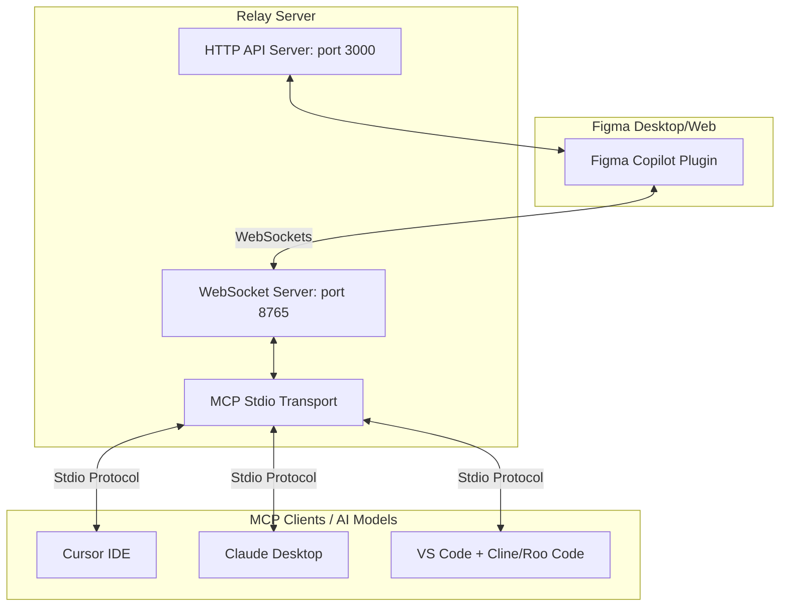

# Figma Copilot & MCP Relay Integration

Dự án này là sự kết hợp giữa **Figma Plugin** (React UI + Figma Sandbox Code) và một **MCP Server Relay** (Node.js + WebSockets + HTTP). Hệ thống này cho phép các mô hình AI (như **Gemini, Claude, GPT-4, Llama...**) giao tiếp trực tiếp với Figma thông qua các ứng dụng hỗ trợ **Model Context Protocol (MCP)** để quét giao diện thiết kế, tạo khung màn hình, cập nhật hoặc xóa các thành phần (node) trong Figma theo thời gian thực.

---

## 🏗️ Kiến trúc Hệ thống



1. **Figma Copilot Plugin**: Chạy trực tiếp bên trong ứng dụng Figma, kết nối qua WebSocket đến Relay Server để thực thi các lệnh vẽ, đọc thông tin canvas Figma thông qua Figma API.
2. **MCP Relay Server**:
   - Giao tiếp với Figma Plugin qua WebSockets (`port 8765`).
   - Cung cấp giao thức MCP chuẩn qua Stdio để tích hợp với các IDE/Client AI.
   - Cung cấp HTTP API bổ sung tại `port 3000` cho các request REST thông thường.

---

## 🛠️ Hướng Dẫn Cài Đặt Chuẩn Chỉ

Đảm bảo máy của bạn đã cài đặt **Node.js (v18+)** và **npm**.

### Bước 1: Build Figma Plugin
1. Di chuyển vào thư mục của plugin:
   ```bash
   cd figma-copilot-plugin
   ```
2. Cài đặt các package phụ thuộc:
   ```bash
   npm install
   ```
3. Đóng gói mã nguồn (Webpack):
   ```bash
   npm run build
   ```
   *(Hoặc dùng lệnh `npm run watch` nếu bạn đang phát triển và chỉnh sửa code liên tục).*

### Bước 2: Build MCP Relay Server
1. Di chuyển vào thư mục máy chủ MCP:
   ```bash
   cd mcp-server
   ```
2. Cài đặt các package phụ thuộc:
   ```bash
   npm install
   ```
3. Biên dịch TypeScript sang JavaScript:
   ```bash
   npm run build
   ```

---

## 🚀 Cách Khởi Chạy Hệ Thống

### 1. Chạy MCP Relay Server
Trong thư mục `figma-copilot-plugin/mcp-server`, chạy lệnh:
```bash
npm start
```
*Màn hình console sẽ thông báo:*
- `[relay] WS listening: ws://127.0.0.1:8765` (Kênh giao tiếp với Figma)
- `[relay] HTTP listening: http://127.0.0.1:3000` (Kênh API HTTP)

### 2. Tải và chạy Plugin trên ứng dụng Figma
1. Mở ứng dụng **Figma Desktop** (hoặc Figma trên trình duyệt).
2. Vào menu **Plugins** > **Development** > **New Plugin...**
3. Nhấp chọn **Link existing plugin** (Liên kết plugin có sẵn).
4. Tìm và chọn file `manifest.json` nằm trong thư mục `figma-copilot-plugin`.
5. Sau khi import thành công, chạy plugin này từ danh sách phát triển. 
   - *Khi plugin mở lên, console của MCP Server sẽ hiển thị: `[relay] Figma plugin connected`.*

---

## ⚙️ Cấu Hình MCP Cho Các Model/Client Khác Nhau

Sau khi đã bật MCP Server ở trạng thái sẵn sàng, bạn có thể liên kết nó với các Client AI để điều khiển Figma:

### A. Cấu hình trên Cursor IDE (Hỗ trợ Gemini, Claude, GPT-4o,...)
1. Mở **Cursor**, đi tới **Cursor Settings** (icon bánh răng góc trên cùng bên phải) > Chọn tab **Features**.
2. Cuộn xuống phần **MCP** > Nhấp chọn **+ Add New MCP Server**.
3. Điền các thông tin như sau:
   - **Name**: `Figma-Relay`
   - **Type**: `command`
   - **Command**:
     ```bash
     node "C:\Users\HP\Desktop\figma\figma-copilot-plugin\mcp-server\dist\server.js"
     ```
     *(Lưu ý: Thay đổi đường dẫn tuyệt đối chính xác tới file `server.js` trên máy của bạn).*
4. Nhấn **Save**. Khi trạng thái hiển thị dấu tích xanh lá cây là kết nối thành công. Giờ đây bạn có thể dùng Composer/Chat của Cursor để yêu cầu AI đọc và sửa thiết kế Figma.

### B. Cấu hình trên Claude Desktop (Sử dụng Claude 3.5 Sonnet)
1. Mở hoặc tạo file cấu hình của Claude Desktop tại đường dẫn sau trên Windows:
   `%APPDATA%\Claude\claude_desktop_config.json`
2. Cấu hình nội dung file như sau:
   ```json
   {
     "mcpServers": {
       "figma-relay": {
         "command": "node",
         "args": [
           "C:/Users/HP/Desktop/figma/figma-copilot-plugin/mcp-server/dist/server.js"
         ]
       }
     }
   }
   ```
3. Lưu file và khởi động lại **Claude Desktop**. Bạn sẽ thấy biểu tượng MCP xuất hiện ở khung chat.

### C. Cấu hình trên VS Code (Sử dụng extension Cline / Roo Code)
1. Cài đặt extension **Cline** hoặc **Roo Code** từ VS Code Marketplace.
2. Mở cấu hình MCP của extension (thường tự động tạo file `cline_mcp_settings.json` tại thư mục dữ liệu của Extension).
3. Thêm cấu hình:
   ```json
   {
     "mcpServers": {
       "figma-relay": {
         "command": "node",
         "args": [
           "C:/Users/HP/Desktop/figma/figma-copilot-plugin/mcp-server/dist/server.js"
         ],
         "disabled": false
       }
     }
   }
   ```

---

## 🛠️ Danh Sách Các MCP Tools Cung Cấp

Khi tích hợp thành công, các mô hình AI sẽ nhận diện và có quyền gọi các Tool sau để thao tác với bản vẽ Figma của bạn:

| Tên Tool | Đầu vào (Arguments) | Mô tả |
| :--- | :--- | :--- |
| `figma_scan_document` | Không có | Quét toàn bộ tài liệu Figma đang mở (lấy danh sách các trang và các frame ở cấp cao nhất). |
| `figma_generate_screens` | `names` (mảng tên các screen), `targetPageName` | Tạo tự động các khung màn hình trống theo danh sách tên vào một trang đích chỉ định. |
| `figma_generate_from_prompt`| `prompt` (mô tả yêu cầu), `targetPageName` | Vẽ các thành phần thiết kế từ prompt tự nhiên (ví dụ: vẽ hình chữ nhật, chèn văn bản...). |
| `figma_scan_and_generate_from_prompt` | `prompt`, `targetPageName` | Quy trình một chạm: Quét thiết kế hiện tại trước, sau đó dựng giao diện mới dựa trên prompt. |
| `figma_scan_document_to_file` | `outputFileName`, `timeoutMs` | Quét tài liệu Figma và lưu dữ liệu dưới dạng file JSON thô trực tiếp vào thư mục máy tính. |
| `figma_update_node` | `nodeId`, `updates` (object thuộc tính) | Cập nhật thuộc tính (màu sắc, kích thước, tọa độ...) của một node thiết kế chỉ định. |
| `figma_attach_node` | `parentId`, `nodeId`, `index` | Di chuyển/lồng một node con vào bên trong một node cha mới. |
| `figma_delete_node` | `nodeId` | Xóa bỏ một node thiết kế khỏi Figma canvas. |