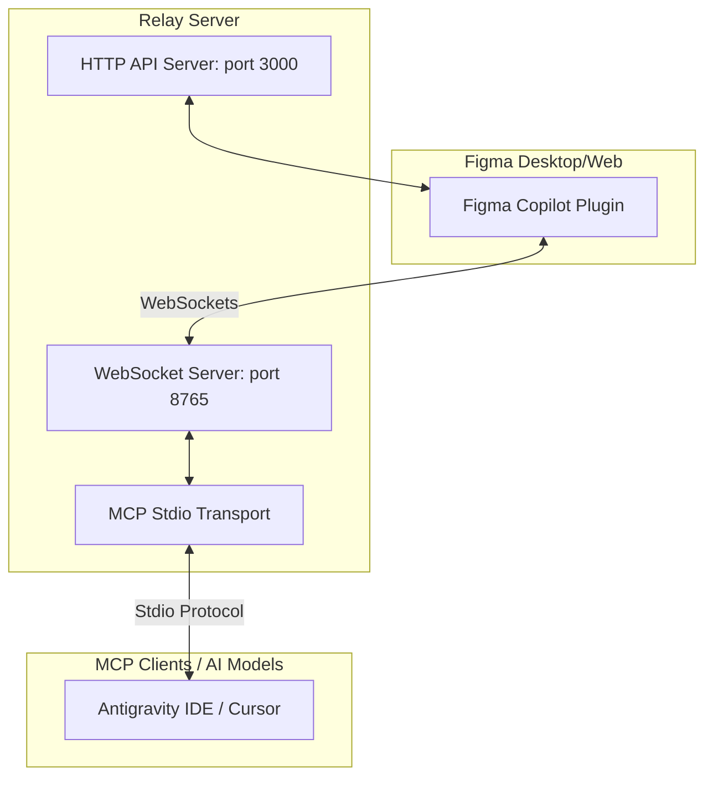

# Hướng Dẫn Tích Hợp Figma Copilot & MCP Relay

Dự án này kết hợp giữa **Figma Plugin** (React UI + Figma Sandbox Code) và một **MCP Server Relay** (Node.js + WebSockets + HTTP). Hệ thống này cho phép các mô hình AI trong **Antigravity IDE** (và các client hỗ trợ MCP khác như Cursor, Claude Desktop...) giao tiếp trực tiếp với Figma để quét giao diện thiết kế, tự động vẽ/cập nhật hoặc xóa các thành phần (node) trong Figma theo thời gian thực.

---

## 🏗️ Kiến trúc Hệ thống



---

## 🛠️ Hướng Dẫn Cài Đặt & Sử Dụng

### Bước 1: Build Figma Plugin
1. Di chuyển vào thư mục của plugin:
   ```bash
   cd figma-desktop-plugin
   ```
2. Cài đặt các thư viện phụ thuộc:
   ```bash
   npm install
   ```
3. Đóng gói mã nguồn (Webpack):
   ```bash
   npm run build
   ```

### Bước 2: Tải và Chạy Plugin trên Figma
1. Mở ứng dụng **Figma Desktop** (hoặc Figma trên trình duyệt web) và mở một file thiết kế bất kỳ.
2. Vào menu **Plugins** > **Development** > **Import plugin from manifest...** (hoặc *Link existing plugin...*).
3. Tìm và chọn file `manifest.json` nằm trong thư mục `figma-desktop-plugin`.
4. Khởi chạy plugin này từ danh sách phát triển. 

---

## ⚙️ Cấu Hình MCP Trên Antigravity IDE (hoặc Cursor)

Khi bạn sử dụng **Antigravity IDE**, **bạn KHÔNG cần chạy lệnh `npm start` trong terminal**. IDE sẽ tự động khởi chạy tiến trình MCP Relay chạy ngầm thông qua Stdio khi bạn gọi các công cụ AI.

1. Mở **Antigravity IDE Settings** (hoặc Cursor Settings) > tab **Features**.
2. Cuộn xuống phần **MCP** > Nhấp chọn **+ Add New MCP Server**.
3. Điền thông tin như sau:
   - **Name**: `figma-relay`
   - **Type**: `command`
   - **Command**:
     ```bash
     node "C:\Users\HP\Desktop\figma\figma-desktop-plugin\mcp-server\dist\server.js"
     ```
     *(Lưu ý: Thay đổi đường dẫn tuyệt đối chính xác tới file `server.js` trên máy của bạn).*
4. Nhấn **Save**. 

---

## 💡 Lưu Ý Quan Trọng & Sửa Lỗi (Troubleshooting)

### 1. Lỗi trùng cổng kết nối (Port Conflict)
* **Hiện tượng:** Nếu bạn chạy cả `npm start` thủ công trong terminal và đồng thời gọi AI trên IDE, bạn sẽ gặp lỗi trùng cổng kết nối (`8765` hoặc `3000`).
* **Khắc phục:** Không chạy `npm start` trong terminal nữa. Hãy tắt terminal đó đi bằng phím `Ctrl + C`. IDE sẽ tự lo phần khởi chạy server.

### 2. Trạng thái "Figma plugin is not connected"
* **Nguyên nhân:** Do plugin Figma của bạn chưa được mở, hoặc kết nối WebSocket bị ngắt mà plugin không có cơ chế tự động kết nối lại (auto-reconnect).
* **Khắc phục:** 
  1. Trên Figma, **tắt cửa sổ plugin đi rồi mở lại**.
  2. Đảm bảo trên giao diện plugin Figma hiển thị trạng thái **`Connected → ws://127.0.0.1:8765`**.

### 3. Lỗi "connection closed: client is closing: EOF"
* **Nguyên nhân:** Khi tiến trình MCP cũ bị tắt đột ngột (ví dụ như khi bạn tắt terminal bị xung đột cổng), IDE sẽ giữ kết nối cũ ở trạng thái đang đóng và không tự phục hồi ngay.
* **Khắc phục:** 
  1. Nhấn tổ hợp phím **`Ctrl + Shift + P`** trên Antigravity IDE để mở Command Palette.
  2. Nhập và chọn lệnh **`Restart MCP Servers`** rồi nhấn **Enter**.
  3. Hoặc đơn giản nhất là khởi động lại cửa sổ IDE.

---

## 🛠️ Danh Sách Các MCP Tools Cung Cấp

| Tên Tool | Đầu vào (Arguments) | Mô tả |
| :--- | :--- | :--- |
| `figma_scan_document` | Không có | Quét toàn bộ tài liệu Figma đang mở (lấy danh sách các trang và các frame). |
| `figma_delete_node` | `nodeId` | Xóa bỏ một node thiết kế khỏi Figma canvas. |
| `figma_generate_screens` | `names` (mảng tên), `targetPageName` | Tạo tự động các khung màn hình trống theo danh sách tên chỉ định. |
| `figma_generate_from_prompt` | `prompt` (mô tả), `targetPageName` | Vẽ các thành phần thiết kế từ prompt tự nhiên (chữ nhật, text...). |
| `figma_scan_and_generate_from_prompt` | `prompt`, `targetPageName` | Quét thiết kế hiện tại trước, sau đó dựng giao diện mới dựa trên prompt. |
| `figma_scan_document_to_file` | `outputFileName`, `timeoutMs` | Quét tài liệu Figma và lưu dữ liệu dưới dạng file JSON trực tiếp. |
| `figma_update_node` | `nodeId`, `updates` | Cập nhật thuộc tính (màu sắc, kích thước, tọa độ...) của một node thiết kế. |
| `figma_attach_node` | `parentId`, `nodeId`, `index` | Di chuyển/lồng một node con vào bên bên trong một node cha mới. |